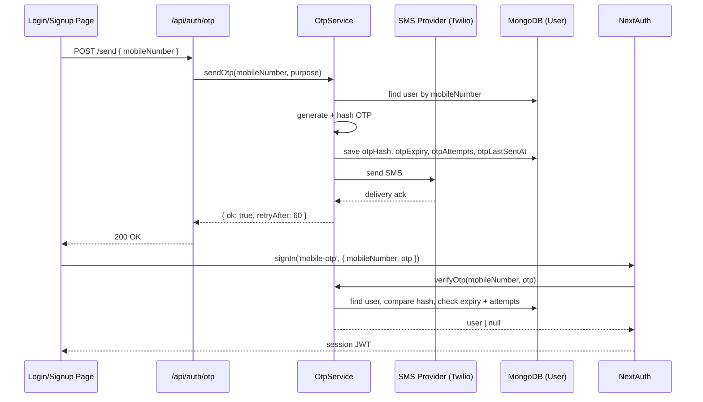

# Design Document: Mobile Number Login

## Overview

This feature extends TeeShop's authentication system to support mobile number + OTP login as an alternative to email/password and Google OAuth. Users can register with a phone number, log in via SMS OTP, and link a mobile number to an existing email account.

The implementation builds on the existing NextAuth setup by adding a new `mobile-otp` credentials provider. OTP generation, hashing, and lifecycle management live in a dedicated service layer. SMS delivery is abstracted behind a configurable provider interface (defaulting to Twilio).

### Key Design Decisions

- **OTP stored as bcrypt hash** — never stored in plaintext, consistent with how passwords are handled today.
- **OTP state on the User document** — avoids a separate collection; OTP fields are cleared after successful verification.
- **New NextAuth provider** — `mobile-otp` provider sits alongside the existing `credentials` provider; no changes to existing auth flows.
- **E.164 normalization at ingestion** — all mobile numbers are normalized to E.164 before storage, so `+14155552671` and `14155552671` resolve to the same record.
- **Rate limiting via `otpLastSentAt`** — a single timestamp field enforces the 60-second resend cooldown without a separate rate-limit store.

---

## Architecture



### Component Map

```
src/
  lib/
    auth.ts                  ← add mobile-otp provider
    otp.ts                   ← OtpService (generate, send, verify)
    sms.ts                   ← SmsProvider abstraction + Twilio adapter
  models/
    User.ts                  ← extend schema with mobile + OTP fields
  app/
    api/
      auth/
        otp/
          route.ts           ← POST /api/auth/otp/send
      user/
        mobile/
          route.ts           ← POST /api/user/mobile (account linking)
    (store)/
      login/
        page.tsx             ← add mobile login tab
      signup/
        page.tsx             ← add mobile registration tab
  components/
    PhoneInput.tsx           ← country code selector + number input
    OtpInput.tsx             ← 6-digit OTP entry widget
```

---

## Components and Interfaces

### OtpService (`src/lib/otp.ts`)

```typescript
interface SendOtpResult {
  ok: boolean;
  retryAfter?: number; // seconds remaining in cooldown
  error?: string;
}

interface VerifyOtpResult {
  ok: boolean;
  userId?: string;
  error?: 'invalid' | 'expired' | 'max_attempts' | 'not_found';
}

// purpose distinguishes registration vs login flows
type OtpPurpose = 'register' | 'login' | 'link';

async function sendOtp(mobileNumber: string, purpose: OtpPurpose): Promise<SendOtpResult>
async function verifyOtp(mobileNumber: string, code: string): Promise<VerifyOtpResult>
```

### SmsProvider (`src/lib/sms.ts`)

```typescript
interface SmsProvider {
  send(to: string, body: string): Promise<{ messageId: string }>;
}

// Twilio implementation reads from env:
//   TWILIO_ACCOUNT_SID, TWILIO_AUTH_TOKEN, TWILIO_FROM_NUMBER
function createSmsProvider(): SmsProvider
```

### PhoneInput component (`src/components/PhoneInput.tsx`)

```typescript
interface PhoneInputProps {
  value: string;           // E.164 formatted
  onChange: (e164: string) => void;
  error?: string;
}
```

### OtpInput component (`src/components/OtpInput.tsx`)

```typescript
interface OtpInputProps {
  length?: number;         // default 6
  onComplete: (code: string) => void;
  error?: string;
  disabled?: boolean;
}
```

### API Routes

| Method | Path | Purpose |
|--------|------|---------|
| POST | `/api/auth/otp/send` | Send OTP (register or login) |
| POST | `/api/user/mobile` | Link mobile to existing account (authenticated) |

**POST `/api/auth/otp/send` request body:**
```typescript
{ mobileNumber: string; purpose: 'register' | 'login' }
```

**POST `/api/auth/otp/send` response:**
```typescript
// 200
{ retryAfter: 60 }
// 400 – validation error
{ error: string }
// 409 – number already registered (register purpose)
{ error: 'Mobile number already in use.' }
// 404 – number not found (login purpose)
{ error: 'No account found for this number.' }
// 429 – cooldown active
{ error: string; retryAfter: number }
```

---

## Data Models

### Extended User Schema

The existing `UserSchema` in `src/models/User.ts` gains the following fields:

```typescript
// Mobile number in E.164 format, e.g. "+14155552671"
mobileNumber: { type: String, unique: true, sparse: true }

// OTP lifecycle fields (cleared after successful verification)
otpHash:       { type: String }
otpExpiry:     { type: Date }
otpAttempts:   { type: Number, default: 0 }
otpLastSentAt: { type: Date }
```

`sparse: true` on `mobileNumber` allows the unique index to coexist with documents that have no mobile number (email/OAuth users).

### OTP Lifecycle State Machine

```
IDLE ──sendOtp()──► PENDING (hash stored, expiry = now+10min)
PENDING ──verifyOtp() correct──► IDLE (fields cleared)
PENDING ──verifyOtp() wrong (< 5)──► PENDING (attempts++)
PENDING ──verifyOtp() wrong (= 5)──► IDLE (fields cleared, error: max_attempts)
PENDING ──expiry passed──► IDLE (rejected on next verify attempt)
PENDING ──sendOtp() again──► PENDING (previous OTP invalidated, new one issued)
```

### TypeScript Type Extension

```typescript
// src/types/next-auth.d.ts  (extend existing declarations)
declare module 'next-auth' {
  interface User {
    mobileNumber?: string;
  }
}
```

---

## Correctness Properties

*A property is a characteristic or behavior that should hold true across all valid executions of a system — essentially, a formal statement about what the system should do. Properties serve as the bridge between human-readable specifications and machine-verifiable correctness guarantees.*


### Property 1: Mobile number validation is consistent

*For any* string input to the mobile number validator, the result should be `valid` if and only if the string represents a number with 7–15 digits (after stripping the leading `+` and country code), and `invalid` otherwise — regardless of which flow (registration or login) invokes the validator.

**Validates: Requirements 1.3, 2.3**

### Property 2: OTP is always exactly 6 digits

*For any* OTP generation request, the produced code should be a string of exactly 6 numeric digits (i.e., matches `/^\d{6}$/`).

**Validates: Requirements 1.5, 2.5, 3.1**

### Property 3: Correct OTP within expiry creates account or session

*For any* valid mobile number and the correct OTP submitted before its expiry timestamp, the system should either create a new user account (registration) or return a valid authenticated session (login) — and the resulting user document should contain the mobile number.

**Validates: Requirements 1.7, 2.6**

### Property 4: Incorrect OTP allows retry up to 5 attempts, then invalidates

*For any* mobile number with a pending OTP, submitting an incorrect code should return an error and increment `otpAttempts`. After exactly 5 incorrect attempts, the OTP fields should be cleared and further submissions should be rejected even if the correct code is provided.

**Validates: Requirements 1.8, 1.9, 2.7, 2.8**

### Property 5: Duplicate mobile number is always rejected

*For any* mobile number already stored in the User_Store, any attempt to register a new account with that number, or link it to a different account, should return an error indicating the number is already in use — and no new record should be created or updated.

**Validates: Requirements 1.10, 4.2, 5.4**

### Property 6: Mobile numbers are stored in E.164 format

*For any* mobile number accepted by the system (registration or linking), the value persisted in the User_Store should be in E.164 format (starts with `+`, followed by 7–15 digits), regardless of how the user entered it.

**Validates: Requirements 1.11, 4.1**

### Property 7: Mobile OTP session is equivalent to email/password session

*For any* user authenticated via mobile OTP, the JWT session token should contain the same fields (`id`, `role`, `status`) as a token issued via email/password login for the same user.

**Validates: Requirements 2.9**

### Property 8: OTP state is stored as a hash with a future expiry

*For any* OTP generation event, the value written to `otpHash` should not equal the plaintext OTP, and `otpExpiry` should be approximately 10 minutes after the generation timestamp (within a 5-second tolerance).

**Validates: Requirements 3.2, 4.4**

### Property 9: Expired OTP is rejected

*For any* OTP whose `otpExpiry` timestamp is in the past, submitting that OTP (even the correct code) should return an expiry error and not authenticate the user.

**Validates: Requirements 3.3**

### Property 10: Requesting a new OTP invalidates the previous one

*For any* mobile number with a pending OTP, requesting a new OTP should result in the previous OTP being rejected (even if the correct code is submitted), and only the newly issued OTP should be accepted.

**Validates: Requirements 3.4**

### Property 11: OTP send rate limiting is enforced

*For any* mobile number, a second OTP send request within 60 seconds of the first should be rejected with a rate-limit error that includes the remaining wait time. A request after 60 seconds should succeed.

**Validates: Requirements 3.5, 3.6**

### Property 12: OTP fields are cleared after successful verification

*For any* mobile number after a successful OTP verification, the user document in the User_Store should have `otpHash`, `otpExpiry`, and `otpAttempts` all absent or null — and submitting the same OTP again should be rejected.

**Validates: Requirements 3.7, 4.5**

### Property 13: Account linking requires OTP verification before saving

*For any* authenticated user attempting to link a mobile number, the `mobileNumber` field should not be written to the user document until a correct OTP for that number has been verified.

**Validates: Requirements 5.2**

### Property 14: SMS provider failure does not create an OTP record

*For any* OTP send request where the SMS provider throws an error, the user document should not have `otpHash`, `otpExpiry`, or `otpAttempts` written — the system should return an error to the caller without persisting any OTP state.

**Validates: Requirements 6.1**

---

## Error Handling

| Scenario | HTTP Status | Error Response |
|----------|-------------|----------------|
| Invalid mobile number format | 400 | `{ error: "Invalid mobile number format." }` |
| Number not registered (login) | 404 | `{ error: "No account found for this number." }` |
| Number already registered (register) | 409 | `{ error: "Mobile number already in use." }` |
| OTP rate limit active | 429 | `{ error: "Please wait N seconds before requesting a new code.", retryAfter: N }` |
| Incorrect OTP | 401 | `{ error: "Incorrect code. N attempts remaining." }` |
| OTP expired | 401 | `{ error: "Code has expired. Please request a new one." }` |
| Max OTP attempts reached | 401 | `{ error: "Too many attempts. Please request a new code." }` |
| SMS provider failure | 502 | `{ error: "Failed to send SMS. Please try again." }` |
| Internal server error | 500 | `{ error: "Internal server error." }` |

All OTP verification errors are returned from the NextAuth `authorize` callback as `null` (which NextAuth maps to a sign-in error), with the specific error surfaced via a custom error code in the redirect URL.

---

## Testing Strategy

### Dual Testing Approach

Both unit tests and property-based tests are required. They are complementary:

- **Unit tests** cover specific examples, integration points, and error conditions.
- **Property tests** verify universal correctness across randomly generated inputs.

### Unit Tests

Focus areas:
- `PhoneInput` renders country code selector and number field
- `OtpInput` renders 6 boxes and calls `onComplete` when filled
- Login page toggle switches between email and mobile modes
- Signup page toggle switches between email and mobile modes
- `POST /api/auth/otp/send` returns 409 for duplicate number
- `POST /api/auth/otp/send` returns 404 for unregistered number (login)
- `POST /api/auth/otp/send` returns 429 within 60-second cooldown
- User model allows `mobileNumber` to be absent (email/OAuth users)

### Property-Based Tests

**Library**: [fast-check](https://github.com/dubzzz/fast-check) (TypeScript, integrates with Jest/Vitest)

**Configuration**: Each property test must run a minimum of **100 iterations**.

Each test must include a comment in this format:
```
// Feature: mobile-number-login, Property N: <property text>
```

| Property | Test Description |
|----------|-----------------|
| P1 | Generate arbitrary strings; assert validator accepts only E.164-valid numbers |
| P2 | Generate arbitrary OTP requests; assert all produced codes match `/^\d{6}$/` |
| P3 | Generate valid mobile + correct OTP; assert account created / session returned |
| P4 | Generate sequences of wrong OTPs; assert retry count and invalidation at attempt 5 |
| P5 | Generate existing mobile numbers; assert duplicate registration/linking rejected |
| P6 | Generate valid mobile numbers in various formats; assert stored value is E.164 |
| P7 | Generate users; assert mobile OTP JWT contains same fields as credentials JWT |
| P8 | Generate OTP events; assert hash ≠ plaintext and expiry ≈ now + 10 min |
| P9 | Generate expired OTPs; assert verification returns expiry error |
| P10 | Generate two sequential OTP requests; assert first OTP rejected after second issued |
| P11 | Generate rapid OTP requests; assert second within 60s is rejected with retryAfter |
| P12 | Generate successful verifications; assert OTP fields cleared and reuse rejected |
| P13 | Generate link requests; assert mobileNumber not saved until OTP verified |
| P14 | Generate SMS provider failures; assert no OTP state written to DB |
