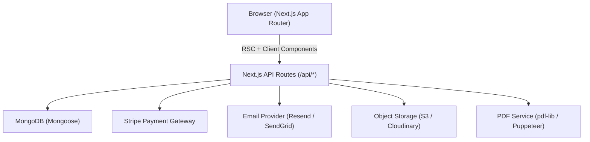

# Design Document: T-Shirt E-Commerce Platform

## Overview

A full-featured T-shirt e-commerce platform built on an existing Next.js (App Router) codebase. The system serves two audiences — shoppers and admins — and is organized around eight core services: Auth, Product, Cart, Wishlist, Order, Invoice, Notification, and Admin. The platform uses MongoDB as its primary database (already wired via `src/lib/db.ts`), NextAuth.js for authentication, Stripe for payments, and a PDF generation library for invoices.

The existing codebase provides a solid skeleton: Redux Toolkit slices for auth/cart/products, Mongoose models for User/Product/Order, and a component library (Navbar, ProductCard, CartItem, etc.). This design extends and refines those foundations rather than replacing them.

---

## Architecture



### Key Architectural Decisions

- **Next.js App Router** — Server Components for data-fetching pages (product listing, order history); Client Components for interactive UI (cart, filters, checkout steps).
- **MongoDB + Mongoose** — Document model fits the variant-heavy product schema. Existing connection pooling in `src/lib/db.ts` is reused.
- **NextAuth.js** — Replaces the custom auth skeleton. Supports credentials (email/password) and Google OAuth. JWT sessions stored as HTTP-only cookies.
- **Redux Toolkit** — Retained for client-side cart and wishlist state. Server state (products, orders) fetched via React Query or SWR for cache management.
- **Stripe** — Payment Gateway integration via `@stripe/stripe-js` on the client and `stripe` SDK on the server.
- **Resend (or SendGrid)** — Transactional email delivery for confirmations, status changes, password resets.
- **Cloudinary** — Image upload and CDN delivery for product images (up to 6 per product).
- **pdf-lib** — Lightweight PDF generation for invoices, avoiding a headless browser dependency.

---

## Components and Interfaces

### Page Components (App Router)

| Route | Type | Description |
|---|---|---|
| `/` | Server | Home page — hero, new arrivals, categories, featured, testimonials |
| `/products` | Server + Client | Product listing with filters/sort/pagination |
| `/products/[id]` | Server + Client | Product detail with variant selector |
| `/wishlist` | Client (auth-guarded) | Wishlist page |
| `/cart` | Client | Cart page |
| `/checkout` | Client (auth-guarded) | Multi-step checkout |
| `/orders` | Server (auth-guarded) | Order history |
| `/orders/[id]` | Server (auth-guarded) | Order detail + invoice download |
| `/login` | Client | Login with credentials + Google |
| `/signup` | Client | Registration form |
| `/admin/dashboard` | Server (admin-guarded) | Metrics + charts |
| `/admin/products` | Server + Client (admin-guarded) | Product CRUD |
| `/admin/inventory` | Server + Client (admin-guarded) | Inventory table + CSV import |
| `/admin/orders` | Server + Client (admin-guarded) | Order management |
| `/admin/users` | Server + Client (admin-guarded) | User management |

### Shared UI Components

- `Navbar` — extended with notification bell, wishlist badge, cart badge
- `ProductCard` — extended with wishlist toggle button
- `ProductList` — paginated grid
- `CartItem` — extended with out-of-stock warning
- `SearchBar` — debounced, 500ms
- `Loader` — skeleton and spinner variants
- `CheckoutStepper` — multi-step progress indicator
- `NotificationPanel` — dropdown panel from bell icon
- `InvoiceDownloadButton` — triggers `/api/invoices/[orderId]`
- `AdminDataTable` — reusable sortable/filterable table for admin pages
- `RevenueChart` — Recharts line chart for dashboard

### API Route Interfaces

All API routes live under `src/app/api/`. Auth-protected routes validate the NextAuth session server-side.

```
POST   /api/auth/[...nextauth]     — NextAuth handler
POST   /api/auth/register          — New user registration
POST   /api/auth/reset-password    — Request password reset link
POST   /api/auth/reset-password/confirm — Confirm reset with token

GET    /api/products               — List products (search, filter, sort, paginate)
POST   /api/products               — Create product (admin)
GET    /api/products/[id]          — Get product detail
PUT    /api/products/[id]          — Update product (admin)
DELETE /api/products/[id]          — Soft-delete product (admin)
POST   /api/products/[id]/images   — Upload/reorder images (admin)

GET    /api/inventory              — List all variants (admin)
PUT    /api/inventory/[variantId]  — Update stock count (admin)
POST   /api/inventory/import       — Bulk CSV import (admin)

GET    /api/wishlist               — Get current user's wishlist
POST   /api/wishlist               — Add product to wishlist
DELETE /api/wishlist/[productId]   — Remove product from wishlist

GET    /api/cart                   — Get current user's cart
POST   /api/cart                   — Add/update cart item
DELETE /api/cart/[itemId]          — Remove cart item
POST   /api/cart/discount          — Apply discount code

POST   /api/checkout/session       — Create Stripe payment intent
POST   /api/checkout/confirm       — Confirm order after payment success

GET    /api/orders                 — List orders (shopper: own; admin: all)
GET    /api/orders/[id]            — Get order detail
PUT    /api/orders/[id]/status     — Update order status (admin)
GET    /api/orders/export          — Export orders CSV (admin)

GET    /api/invoices/[orderId]     — Download invoice PDF
POST   /api/invoices/[orderId]     — Generate invoice on demand

GET    /api/notifications          — Get user notifications
PUT    /api/notifications/read     — Mark all as read

GET    /api/admin/users            — List users (admin)
PUT    /api/admin/users/[id]/suspend   — Suspend user (admin)
PUT    /api/admin/users/[id]/reinstate — Reinstate user (admin)

GET    /api/admin/dashboard        — Dashboard metrics
```

---

## Data Models

The existing Mongoose models are extended to support all requirements. New models are added for Wishlist, Cart, Inventory, Invoice, Notification, and DiscountCode.

### User (extended)

```typescript
interface IUser {
  _id: ObjectId;
  name: string;
  email: string;                    // unique index
  password?: string;                // hashed; absent for OAuth users
  role: 'user' | 'admin';
  status: 'active' | 'suspended';  // NEW
  oauthProvider?: 'google';        // NEW
  oauthId?: string;                // NEW
  marketingOptOut: boolean;        // NEW
  resetToken?: string;             // NEW — hashed reset token
  resetTokenExpiry?: Date;         // NEW
  createdAt: Date;
}
```

### Product (extended)

```typescript
interface IProduct {
  _id: ObjectId;
  title: string;                   // renamed from 'name' for clarity
  description: string;
  price: number;                   // in cents to avoid float issues
  images: string[];                // Cloudinary URLs, ordered
  category: string;
  sizes: string[];
  colors: string[];                // NEW
  featured: boolean;               // NEW
  active: boolean;                 // NEW — soft delete flag
  createdAt: Date;
  updatedAt: Date;
}
```

### Inventory (new model)

```typescript
interface IInventory {
  _id: ObjectId;
  product: ObjectId;              // ref: Product
  size: string;
  color: string;
  stock: number;                  // >= 0
  lowStockThreshold: number;      // default: 5
  updatedAt: Date;
}
// Compound unique index: { product, size, color }
```

### Cart (new model — server-persisted)

```typescript
interface ICartItem {
  product: ObjectId;              // ref: Product
  size: string;
  color: string;
  quantity: number;               // >= 1
  unitPrice: number;              // snapshot at add time
}

interface ICart {
  _id: ObjectId;
  user: ObjectId;                 // ref: User, unique index
  items: ICartItem[];
  discountCode?: string;
  discountAmount: number;         // in cents
  updatedAt: Date;
}
```

### Wishlist (new model)

```typescript
interface IWishlist {
  _id: ObjectId;
  user: ObjectId;                 // ref: User, unique index
  products: ObjectId[];           // ref: Product
  updatedAt: Date;
}
```

### Order (extended)

```typescript
interface IOrderItem {
  product: ObjectId;              // ref: Product
  title: string;                  // snapshot
  size: string;
  color: string;                  // NEW
  quantity: number;
  unitPrice: number;              // snapshot in cents
}

type OrderStatus =
  | 'Confirmed'
  | 'Processing'
  | 'Shipped'
  | 'Out for Delivery'
  | 'Delivered';

interface IStatusEvent {
  status: OrderStatus;
  timestamp: Date;
  adminId?: ObjectId;             // who triggered the change
}

interface IOrder {
  _id: ObjectId;
  user: ObjectId;                 // ref: User
  items: IOrderItem[];
  shippingAddress: IAddress;
  deliveryMethod: string;
  subtotal: number;               // in cents
  taxes: number;
  shippingCost: number;
  discountAmount: number;
  total: number;
  paymentIntentId: string;        // Stripe
  status: OrderStatus;
  statusHistory: IStatusEvent[];
  trackingNumber?: string;
  carrier?: string;
  invoiceId?: ObjectId;           // ref: Invoice
  createdAt: Date;
  updatedAt: Date;
}

interface IAddress {
  fullName: string;
  addressLine1: string;
  addressLine2?: string;
  city: string;
  postalCode: string;
  country: string;
}
```

### Invoice (new model)

```typescript
interface IInvoice {
  _id: ObjectId;
  order: ObjectId;                // ref: Order, unique index
  invoiceNumber: string;          // sequential, e.g. "INV-000042"
  pdfUrl: string;                 // Cloudinary or S3 URL
  generatedAt: Date;
}
// invoiceNumber uses an atomic counter collection for sequential assignment
```

### Notification (new model)

```typescript
type NotificationEvent =
  | 'registration'
  | 'order_confirmed'
  | 'order_status_changed'
  | 'password_reset'
  | 'low_stock';

interface INotification {
  _id: ObjectId;
  user: ObjectId;                 // ref: User
  event: NotificationEvent;
  message: string;
  read: boolean;
  createdAt: Date;                // TTL index: 30 days
}
```

### DiscountCode (new model)

```typescript
interface IDiscountCode {
  _id: ObjectId;
  code: string;                   // unique, case-insensitive
  type: 'percentage' | 'fixed';
  value: number;                  // percent (0-100) or cents
  expiresAt?: Date;
  usageLimit?: number;
  usageCount: number;
  active: boolean;
}
```

---

## State Management

### Server State
- Product listings, order history, admin data — fetched in Server Components or via SWR/React Query in Client Components.
- Mutations go through API routes; cache is invalidated on success.

### Client State (Redux Toolkit — existing slices extended)

```
store/
  auth/     — session user info (hydrated from NextAuth)
  cart/     — cart items, totals, discount (synced with /api/cart)
  products/ — search query, active filters, sort, current page
  wishlist/ — wishlist product IDs (synced with /api/wishlist)  [NEW]
  notifications/ — unread count, notification list             [NEW]
```

Cart and wishlist slices persist to the server on every mutation (optimistic update + server sync).

---

## Authentication & Authorization

### NextAuth.js Configuration

```
providers:
  - CredentialsProvider (email + bcrypt password)
  - GoogleProvider (OAuth)

session: { strategy: 'jwt' }
callbacks:
  jwt: attach user.role and user.status to token
  session: expose role and status to client
```

### Middleware (`src/middleware.ts`)

```
/wishlist, /cart, /checkout, /orders/* → require authenticated session
/admin/*                               → require role === 'admin'
Suspended users                        → redirect to /suspended page
```

### Password Reset Flow

1. User submits email → server generates a cryptographically random token, hashes it, stores hash + expiry (1 hour) on User document.
2. Plain token sent via email as a link: `/reset-password?token=<plain>`.
3. On form submit, server hashes the submitted token, looks up matching User, checks expiry, updates password, clears token fields.

---

## Key Service Designs

### Invoice Service

1. On order confirmation, a background job (or inline async call) invokes `InvoiceService.generate(orderId)`.
2. `generate` fetches the Order with populated items, builds a PDF using `pdf-lib`, uploads to Cloudinary/S3, stores the URL in the Invoice document, and links `order.invoiceId`.
3. On download request (`GET /api/invoices/[orderId]`), if `invoiceId` exists, redirect to the stored PDF URL. If not, generate on demand (Requirement 8.5).
4. Invoice numbers are assigned via an atomic `findOneAndUpdate` on a `Counter` collection (`{ _id: 'invoice', seq: Number }`), formatted as `INV-XXXXXX`.

### Notification Service

- **In-app**: `NotificationService.create(userId, event, message)` inserts a Notification document. A MongoDB TTL index on `createdAt` (30 days) handles automatic deletion.
- **Email**: `NotificationService.sendEmail(to, template, data)` calls the Resend/SendGrid API. Marketing emails check `user.marketingOptOut` before sending.
- **Triggers**: Order confirmation, status change, registration, password reset, low-stock (admin).
- **Real-time badge**: The notification bell polls `GET /api/notifications?unreadOnly=true` every 30 seconds, or uses Server-Sent Events for lower latency.

### Payment Service (Stripe)

1. Client calls `POST /api/checkout/session` → server creates a Stripe PaymentIntent, returns `clientSecret`.
2. Client uses `@stripe/stripe-js` to confirm the payment with card details.
3. On success, client calls `POST /api/checkout/confirm` with `paymentIntentId`.
4. Server verifies the PaymentIntent status with Stripe SDK (never trust client-only), creates the Order, decrements inventory, clears cart, triggers notifications.
5. Stripe webhooks (`/api/webhooks/stripe`) handle async payment events as a fallback.

### Search Service

- MongoDB text index on `Product.title`, `Product.description`, `Product.category`.
- Query: `{ $text: { $search: query }, active: true }` with score-based sorting for relevance.
- Filters applied as additional query predicates.
- Response time target (<500ms) met by the text index; monitored via query explain plans.

---

## Error Handling

- **API routes**: All handlers wrapped in try/catch. Errors return `{ error: string }` with appropriate HTTP status codes (400, 401, 403, 404, 500).
- **Auth errors**: 401 for unauthenticated, 403 for insufficient role. Middleware handles redirects for page routes.
- **Payment errors**: Stripe error messages surfaced to the client verbatim (they are user-safe). Cart is never cleared on failure.
- **Inventory conflicts**: On order confirmation, inventory decrement uses a MongoDB `$inc` with a `$gte: quantity` condition. If the condition fails (race condition), the order is rejected with a "variant out of stock" error and the cart is preserved.
- **CSV import errors**: Each row is validated independently. Invalid rows are collected and returned in the response; valid rows are applied atomically.
- **Invoice generation errors**: Logged server-side; client receives a 503 with a retry message. The invoice can be regenerated on demand.
- **Session expiry**: NextAuth middleware redirects to `/login?callbackUrl=<original>` preserving the destination URL.

---

## Testing Strategy

### Dual Testing Approach

Both unit tests and property-based tests are required. Unit tests cover specific examples, integration points, and error conditions. Property-based tests verify universal correctness properties across randomized inputs.

### Unit Tests

- Auth flows: registration validation, login, password reset token lifecycle
- Cart calculations: subtotal, tax, shipping, discount application
- Order status transitions: valid and invalid transitions
- Invoice number generation: sequential assignment
- Admin access control: role checks, self-suspension prevention
- API route handlers: mocked DB, expected responses for happy/error paths

### Property-Based Tests

- Library: **fast-check** (TypeScript-native, works with Jest/Vitest)
- Minimum **100 iterations** per property test
- Each test tagged with: `// Feature: tshirt-ecommerce-platform, Property N: <property_text>`


---

## Correctness Properties

*A property is a characteristic or behavior that should hold true across all valid executions of a system — essentially, a formal statement about what the system should do. Properties serve as the bridge between human-readable specifications and machine-verifiable correctness guarantees.*

### Property 1: Password length invariant

*For any* registration attempt where the password has fewer than 8 characters, the Auth_Service shall reject the request and no user account shall be created.

**Validates: Requirements 1.1**

---

### Property 2: Duplicate email rejection

*For any* email address already registered in the system, a subsequent registration attempt with that same email shall always fail with an error and shall not create a new account.

**Validates: Requirements 1.2**

---

### Property 3: Generic invalid-credentials error

*For any* login attempt with an incorrect email, an incorrect password, or both, the error message returned shall be identical regardless of which field is wrong — no field-specific information shall be revealed.

**Validates: Requirements 1.4**

---

### Property 4: Session expiry preserves destination URL

*For any* URL path the shopper was attempting to visit, when their session expires and they are redirected to the login page, the original URL shall be preserved as the `callbackUrl` query parameter.

**Validates: Requirements 1.6**

---

### Property 5: Logout invalidates session

*For any* active session token, after the shopper logs out, any subsequent request using that token shall be treated as unauthenticated.

**Validates: Requirements 1.8**

---

### Property 6: New Arrivals shows exactly 8 most recent products

*For any* set of active products in the database, the New Arrivals section shall display exactly the 8 products with the most recent `createdAt` timestamps, in descending order.

**Validates: Requirements 2.3**

---

### Property 7: Featured section contains only featured products

*For any* product set, every product displayed in the Featured/Trending section shall have `featured = true`, and no non-featured product shall appear in that section.

**Validates: Requirements 2.5**

---

### Property 8: Pagination completeness

*For any* set of N active products, paginating through all pages with 12 products per page shall yield exactly N products in total with no duplicates and no omissions.

**Validates: Requirements 3.1**

---

### Property 9: Filters narrow results correctly

*For any* combination of category, size, color, and price range filters applied to any product set, every product in the returned results shall satisfy all selected filter criteria simultaneously.

**Validates: Requirements 3.4**

---

### Property 10: Sort order consistency

*For any* product set and any selected sort option (Newest, Price Low-High, Price High-Low, Best Selling), the returned list shall be ordered strictly according to the chosen sort criterion with no violations of the ordering relation.

**Validates: Requirements 3.6**

---

### Property 11: Product detail contains all required fields

*For any* active product, the product detail page data shall include: all images, title, price, all available sizes, all available colors, stock status, and description.

**Validates: Requirements 3.7**

---

### Property 12: Variant stock reflects selected combination

*For any* product with multiple size/color variants, selecting a specific size+color combination shall display the stock count for exactly that variant's inventory record, not any other variant's count.

**Validates: Requirements 3.8**

---

### Property 13: Zero-stock variant disables Add to Cart

*For any* product variant whose inventory stock count is 0, the Add to Cart button shall be disabled and an "Out of Stock" label shall be displayed.

**Validates: Requirements 3.9**

---

### Property 14: Wishlist round-trip persistence

*For any* authenticated shopper, adding a product to the wishlist and then starting a new session shall result in that product still being present in the wishlist.

**Validates: Requirements 4.1**

---

### Property 15: Wishlist toggle is an involution

*For any* authenticated shopper and any product, toggling the wishlist icon twice (add then remove) shall return the wishlist to its original state, and the badge count shall equal its original value.

**Validates: Requirements 4.2, 4.3**

---

### Property 16: Wishlist page shows all saved products

*For any* shopper's wishlist containing N products, the wishlist page shall display exactly those N products, each with its current price, stock status, and an Add to Cart button.

**Validates: Requirements 4.4**

---

### Property 17: Adding wishlist item to cart retains it in wishlist

*For any* product in a shopper's wishlist, after adding it to the cart, the product shall still appear in the wishlist.

**Validates: Requirements 4.5**

---

### Property 18: Cart quantity management invariant

*For any* cart and product variant, adding the variant when already present shall increment its quantity by exactly 1; setting quantity to 0 shall remove the item entirely from the cart.

**Validates: Requirements 5.2, 5.3**

---

### Property 19: Cart total arithmetic invariant

*For any* cart state, the displayed order total shall equal: subtotal + taxes + shipping - discountAmount, where subtotal equals the sum of (unitPrice × quantity) for all items.

**Validates: Requirements 5.5**

---

### Property 20: Valid discount reduces total

*For any* cart and any valid, non-expired discount code, applying the code shall reduce the order total by exactly the discount amount associated with that code.

**Validates: Requirements 5.6**

---

### Property 21: Invalid discount leaves total unchanged

*For any* cart and any invalid or expired discount code, the order total shall remain unchanged after the application attempt.

**Validates: Requirements 5.7**

---

### Property 22: Out-of-stock cart item disables checkout

*For any* cart containing at least one item whose current inventory stock is 0, the checkout button shall be disabled.

**Validates: Requirements 5.8**

---

### Property 23: Shipping address validation rejects incomplete addresses

*For any* shipping address submission missing any of the required fields (full name, address line 1, city, postal code, country), the Order_Service shall reject the submission with a validation error.

**Validates: Requirements 6.3**

---

### Property 24: Successful payment atomically creates order, decrements inventory, clears cart

*For any* successful payment confirmation, the resulting system state shall satisfy all three conditions simultaneously: a new Order record exists with status "Confirmed", each purchased variant's inventory is decremented by the purchased quantity, and the shopper's cart is empty.

**Validates: Requirements 6.5**

---

### Property 25: Payment failure preserves cart

*For any* payment failure response from the Payment_Gateway, the shopper's cart contents shall be identical to the cart contents before the payment attempt.

**Validates: Requirements 6.6**

---

### Property 26: Confirmed order has an invoice

*For any* confirmed order, an Invoice record shall exist (or be generated on demand) linking to a valid PDF file.

**Validates: Requirements 6.8, 8.5**

---

### Property 27: Order history sorted most recent first

*For any* authenticated shopper with multiple orders, the order history list shall be sorted by `createdAt` in descending order with no ordering violations.

**Validates: Requirements 7.1**

---

### Property 28: Order status transitions follow defined lifecycle

*For any* order, a status update shall only be accepted if the new status is the immediate next value in the sequence: Confirmed → Processing → Shipped → Out for Delivery → Delivered. Any attempt to skip a step or move backwards shall be rejected.

**Validates: Requirements 7.4**

---

### Property 29: Shipped orders display tracking information

*For any* order with status "Shipped", the order detail page data shall include a non-empty tracking number and a non-empty carrier name.

**Validates: Requirements 7.6**

---

### Property 30: Orders are scoped to their owner

*For any* order ID and any shopper whose user ID does not match the order's user field, the Order_Service shall return a 404 response.

**Validates: Requirements 7.7**

---

### Property 31: Invoice contains all required fields

*For any* confirmed order, the generated invoice PDF data structure shall contain: invoice number, issue date, shopper name and address, itemized list with quantities and prices, subtotal, taxes, shipping cost, discount amount, and total amount paid.

**Validates: Requirements 8.1**

---

### Property 32: Invoice numbers are unique and sequential

*For any* two distinct invoices, their invoice numbers shall be different. For any sequence of invoices generated in order, the numeric portion of each invoice number shall be strictly greater than the previous one.

**Validates: Requirements 8.4**

---

### Property 33: Unread badge count matches unread notifications

*For any* user, the unread badge count displayed on the notification bell shall equal the number of notification records for that user where `read = false`.

**Validates: Requirements 9.2**

---

### Property 34: Opening notification panel marks all as read

*For any* user with N unread notifications, after the notification panel is opened, all N notifications shall have `read = true` and the unread badge shall be removed.

**Validates: Requirements 9.3**

---

### Property 35: Notifications older than 30 days are not returned

*For any* user, the notification list returned by the API shall contain no notifications whose `createdAt` timestamp is more than 30 days in the past.

**Validates: Requirements 9.5**

---

### Property 36: Marketing opt-out suppresses promotional emails

*For any* user with `marketingOptOut = true`, no marketing or promotional email shall be sent to that user, while transactional emails (order confirmation, status change, password reset) shall still be delivered.

**Validates: Requirements 9.6**

---

### Property 37: Non-admin users receive 403 on admin routes

*For any* HTTP request to any `/api/admin/*` or `/admin/*` route made by a user without the `admin` role, the response shall be 403 Forbidden.

**Validates: Requirements 10.1**

---

### Property 38: New product variants initialized with zero stock

*For any* newly created product with a set of size/color combinations, every resulting inventory record shall have `stock = 0` immediately after creation.

**Validates: Requirements 10.3**

---

### Property 39: Soft-deleted products excluded from shopper views

*For any* product with `active = false`, it shall not appear in any shopper-facing product listing, search result, category section, or featured section.

**Validates: Requirements 10.6**

---

### Property 40: Admin stock update reflects on shopper detail page

*For any* inventory record updated by an admin, a subsequent request to the shopper-facing product detail API for that variant shall return the updated stock count.

**Validates: Requirements 11.2**

---

### Property 41: Low-stock threshold triggers admin notification

*For any* inventory update that causes a variant's stock to fall below the configured low-stock threshold, a notification shall be created for every user with the `admin` role.

**Validates: Requirements 11.4**

---

### Property 42: CSV import applies only valid rows

*For any* CSV import file containing a mix of valid and invalid rows, only the valid rows shall result in inventory updates, and the response shall include a row-level error report for every invalid row.

**Validates: Requirements 11.6**

---

### Property 43: Admin order filter returns only matching orders

*For any* combination of status, date range, and shopper name/email filters, every order in the filtered result shall satisfy all applied filter criteria.

**Validates: Requirements 12.2**

---

### Property 44: Status change log contains timestamp and admin ID

*For any* order status update performed by an admin, the resulting status history entry shall contain the new status value, the timestamp of the change, and the admin's user ID.

**Validates: Requirements 12.3**

---

### Property 45: Shipped status requires tracking number

*For any* attempt to set an order's status to "Shipped" without providing a non-empty tracking number and carrier name, the update shall be rejected with a validation error.

**Validates: Requirements 12.4**

---

### Property 46: CSV export matches filtered order list

*For any* set of filters applied to the admin orders list, the exported CSV shall contain exactly the same orders as the filtered list — no more, no fewer.

**Validates: Requirements 12.6**

---

### Property 47: Suspend/reinstate round-trip restores login capability

*For any* active shopper account, suspending the account shall prevent login; subsequently reinstating the account shall restore the ability to log in successfully.

**Validates: Requirements 13.2, 13.3**

---

### Property 48: Admin cannot suspend or delete own account

*For any* admin user, any attempt to suspend or delete their own account (matching their own user ID) shall be rejected with an error.

**Validates: Requirements 13.5**

---

### Property 49: Dashboard metrics match underlying data

*For any* time period, the total revenue, total orders, and new shopper count displayed on the dashboard shall equal the values computed by directly aggregating the corresponding Order and User records for that period.

**Validates: Requirements 14.1**

---

### Property 50: Revenue trend chart data matches daily order totals

*For any* 30-day window, each data point in the revenue trend chart shall equal the sum of `total` for all confirmed orders placed on that calendar day.

**Validates: Requirements 14.2**

---

### Property 51: Recent orders widget shows 10 most recent

*For any* set of orders in the system, the recent orders widget shall display exactly the 10 orders with the most recent `createdAt` timestamps, in descending order.

**Validates: Requirements 14.3**
