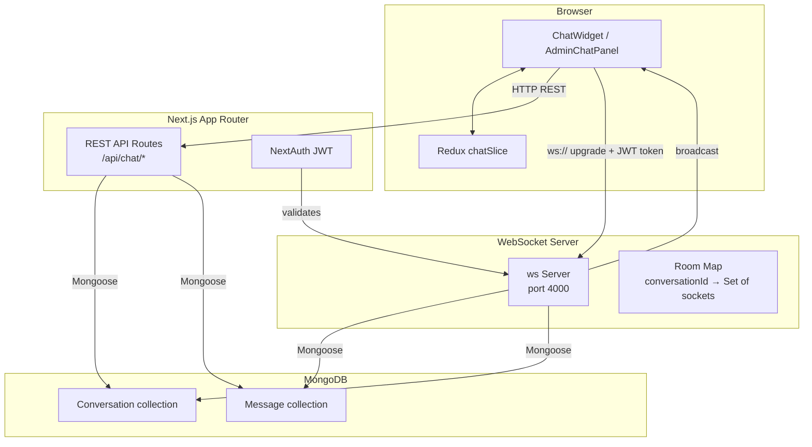
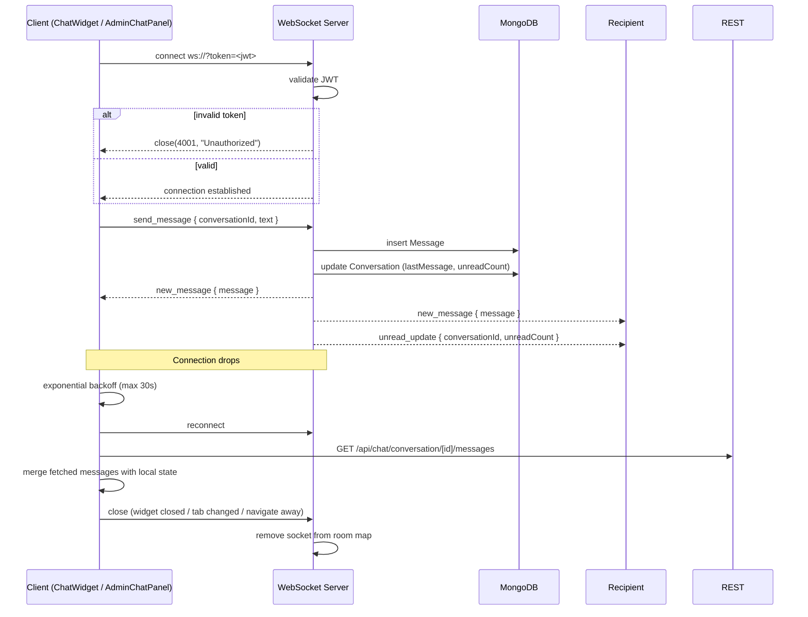

# Design Document: User-Admin Chat

## Overview

This document describes the technical design for the real-time user-admin chat feature in TeeStore. The feature adds a floating `ChatWidget` to the store navbar and a dedicated `AdminChatPanel` page accessible via a new "Chat" tab in the admin sidebar, enabling one-to-one conversations between authenticated store users and the admin via WebSocket.

The core challenge is that Next.js App Router does not natively support a persistent WebSocket server. The chosen approach is a **standalone Node.js WebSocket server** (`ws` library) running as a separate process alongside the Next.js app. In development both processes run concurrently; in production the WebSocket server is deployed as a separate service (e.g., a second container or process). REST API routes in Next.js handle all CRUD operations (history, file upload, unread counts), while the WebSocket server handles only real-time message delivery and read-receipt pushes.

The admin sidebar gains a sixth nav item — **Chat** → `/admin/chat` — alongside the existing five (Dashboard, Products, Inventory, Orders, Users). The `AdminChatPanel` at `src/app/admin/chat/page.tsx` is a full two-column layout: conversation list on the left, active conversation on the right. The Users section is **unchanged**. The Chat nav item in the sidebar displays a badge showing the total admin unread count across all conversations.

---

## Architecture



### Key Design Decisions

- **Standalone WebSocket server**: Next.js route handlers run in a serverless/edge context and cannot hold persistent socket state. A dedicated `ws` server on port 4000 solves this cleanly without third-party managed services.
- **JWT for WebSocket auth**: The client passes its NextAuth JWT as a query parameter (`?token=<jwt>`) on the WebSocket upgrade request. The server validates it using the same `NEXTAUTH_SECRET`.
- **REST for history and uploads**: Message history, file uploads, and unread-count queries go through Next.js API routes, keeping auth middleware and Mongoose connection pooling consistent with the rest of the app.
- **Redux for client state**: A `chatSlice` mirrors the notifications pattern already in the codebase, holding conversation list, active conversation messages, and unread counts.
- **Dedicated Chat page**: The `AdminChatPanel` lives at `src/app/admin/chat/page.tsx` as a standalone full-page route. This keeps the Users section untouched and gives chat a clear, dedicated space in the admin panel.
- **Sixth sidebar nav item**: `src/app/admin/layout.tsx` gains a Chat entry (`💬 Chat → /admin/chat`) with a live unread badge, making it immediately visible from any admin page.

---

## Components and Interfaces

### Store-side Components

#### `ChatWidget` (`src/components/chat/ChatWidget.tsx`)
Floating overlay panel rendered in `Navbar`. Manages its own open/closed state.

```
Props: none (reads session and Redux state internally)

Internal state:
  - isOpen: boolean
  - inputText: string
  - pendingFile: File | null

Behaviour:
  - Hidden when session is null (unauthenticated)
  - On open: dispatches loadConversation(), connects WebSocket
  - On close: disconnects WebSocket gracefully
  - Renders MessageList, MessageInput
```

#### `MessageList` (`src/components/chat/MessageList.tsx`)
Scrollable list of messages for the active conversation.

```
Props:
  - messages: Message[]
  - currentUserId: string
```

#### `MessageInput` (`src/components/chat/MessageInput.tsx`)
Text input + file picker + send button.

```
Props:
  - onSend: (text: string, file?: File) => void
  - disabled: boolean
```

#### `ChatIcon` (inline in `Navbar.tsx`)
Button with unread badge, placed immediately after the notification bell.

### Admin-side Components

#### `AdminChatPanel` (`src/app/admin/chat/page.tsx`)
Full-page admin chat interface. Two-column layout: conversation list on the left, active conversation on the right.

```
Layout:
  ┌─────────────────────┬──────────────────────────────────┐
  │  Conversation List  │  Active Conversation              │
  │  (left column)      │  (right column)                   │
  │                     │                                   │
  │  [User A]  2 unread │  MessageList (scrollable)         │
  │  [User B]           │  MessageInput                     │
  │  [User C]  1 unread │                                   │
  └─────────────────────┴──────────────────────────────────┘

Behaviour:
  - On mount: dispatches loadAdminConversations(), connects WebSocket
  - Selecting a conversation: dispatches loadMessages(conversationId),
    dispatches markConversationRead(conversationId)
  - Renders ConversationList (left) and MessageList + MessageInput (right)
  - Right column shows a placeholder when no conversation is selected
```

#### `ConversationList` (`src/components/chat/ConversationList.tsx`)
Left-column list of all user conversations for the admin.

```
Props:
  - conversations: Conversation[]
  - activeConversationId: string | null
  - onSelect: (conversationId: string) => void
```

Each list item displays: user name, last message preview (≤ 60 chars), timestamp, and an unread badge when `adminUnreadCount > 0`.

#### Admin Sidebar Navigation (`src/app/admin/layout.tsx`)
The `NAV_LINKS` array gains a sixth entry:

```typescript
{ href: '/admin/chat', label: 'Chat', icon: '💬' }
```

The Chat nav item renders a live unread badge showing `adminTotalUnread` from Redux `chatSlice`. When `adminTotalUnread > 0`, a small red badge appears on the nav item. The badge is capped at "9+" for counts exceeding 9.

Because the sidebar is a Server Component, the unread badge is rendered by a thin Client Component wrapper (`AdminChatNavItem`) that reads from Redux and wraps only the Chat link.

### WebSocket Server (`src/server/wsServer.ts`)

Standalone script, run with `node src/server/wsServer.ts` (compiled) or `ts-node`.

```
Incoming message types (client → server):
  { type: 'send_message', conversationId, text?, fileUrl?, fileName?, fileType? }
  { type: 'mark_read', conversationId }

Outgoing message types (server → client):
  { type: 'new_message', message: Message }
  { type: 'unread_update', conversationId, unreadCount }
  { type: 'error', code, message }
```

---

## Data Models

### Conversation

```typescript
// src/models/Conversation.ts
{
  _id: ObjectId,
  userId: ObjectId,          // ref: 'User' — the store customer
  adminUnreadCount: number,  // messages sent by user not yet read by admin
  userUnreadCount: number,   // messages sent by admin not yet read by user
  lastMessage: string,       // preview text (truncated to 60 chars on write)
  lastMessageAt: Date,
  createdAt: Date,
}
```

Indexes:
- `{ userId: 1 }` unique — enforces one conversation per user
- `{ lastMessageAt: -1 }` — for admin list sorted by recency

### Message

```typescript
// src/models/Message.ts
{
  _id: ObjectId,
  conversationId: ObjectId,  // ref: 'Conversation'
  senderId: ObjectId,        // ref: 'User'
  senderRole: 'user' | 'admin',
  text: string | null,       // null when message is attachment-only
  attachmentUrl: string | null,
  attachmentName: string | null,
  attachmentType: 'image' | 'document' | null,
  read: boolean,             // true once recipient has opened the conversation
  createdAt: Date,
}
```

Indexes:
- `{ conversationId: 1, createdAt: 1 }` — for chronological history queries

### TypeScript Types (`src/types/chat.ts`)

```typescript
export interface Conversation {
  _id: string;
  userId: string;
  adminUnreadCount: number;
  userUnreadCount: number;
  lastMessage: string;
  lastMessageAt: string;
  createdAt: string;
  // populated on admin list
  user?: { _id: string; name: string; email: string };
}

export interface Message {
  _id: string;
  conversationId: string;
  senderId: string;
  senderRole: 'user' | 'admin';
  senderName?: string;       // populated on fetch
  text: string | null;
  attachmentUrl: string | null;
  attachmentName: string | null;
  attachmentType: 'image' | 'document' | null;
  read: boolean;
  createdAt: string;
}

export type WsIncoming =
  | { type: 'send_message'; conversationId: string; text?: string; fileUrl?: string; fileName?: string; fileType?: 'image' | 'document' }
  | { type: 'mark_read'; conversationId: string };

export type WsOutgoing =
  | { type: 'new_message'; message: Message }
  | { type: 'unread_update'; conversationId: string; unreadCount: number }
  | { type: 'error'; code: number; message: string };
```

---

## API Routes

### REST (Next.js App Router)

| Method | Path | Auth | Description |
|--------|------|------|-------------|
| GET | `/api/chat/conversation` | user | Get or create the user's conversation |
| GET | `/api/chat/conversation/[id]/messages` | user or admin | Fetch full message history |
| POST | `/api/chat/upload` | user or admin | Upload attachment, returns `{ url, name, type }` |
| GET | `/api/chat/admin/conversations` | admin | List all conversations with user info |
| PUT | `/api/chat/conversation/[id]/read` | user or admin | Mark all messages in conversation as read |
| GET | `/api/chat/unread` | user | Get user's unread count for navbar badge |

### WebSocket Protocol

Connection: `ws://localhost:4000?token=<nextauth-jwt>`

On connect:
1. Server validates JWT using `NEXTAUTH_SECRET`
2. If invalid → close with code `4001`
3. If valid → register socket in an in-memory map keyed by `userId`

On `send_message`:
1. Validate text length (≤ 2000) or attachment fields
2. Persist `Message` to MongoDB
3. Update `Conversation.lastMessage`, `lastMessageAt`, increment recipient's unread count
4. Broadcast `new_message` to all sockets in the conversation (sender + recipient)
5. Broadcast `unread_update` to recipient

On `mark_read`:
1. Set `Message.read = true` for all unread messages in conversation where recipient is caller
2. Reset `Conversation.adminUnreadCount` or `userUnreadCount` to 0
3. Broadcast `unread_update` with count 0 to sender (to update their own badge)

---

## Redux State (`src/features/chat/chatSlice.ts`)

```typescript
interface ChatState {
  conversations: Conversation[];          // admin: all convos; user: single-element array
  activeConversationId: string | null;
  messages: Record<string, Message[]>;    // keyed by conversationId
  userUnreadCount: number;                // for navbar badge
  adminTotalUnread: number;               // sum across all convos — drives sidebar Chat badge
  loading: boolean;
  error: string | null;
}
```

Async thunks:
- `loadConversation()` — GET `/api/chat/conversation`
- `loadMessages(conversationId)` — GET `/api/chat/conversation/[id]/messages`
- `loadAdminConversations()` — GET `/api/chat/admin/conversations`
- `markConversationRead(conversationId)` — PUT `/api/chat/conversation/[id]/read`
- `uploadAttachment(file)` — POST `/api/chat/upload`
- `fetchUserUnreadCount()` — GET `/api/chat/unread`

WebSocket actions (dispatched by the WS hook):
- `receiveMessage(message)` — appends to `messages[conversationId]`
- `updateUnreadCount({ conversationId, count })` — updates badge counts

---

## File Upload Handling

Attachments are uploaded via `POST /api/chat/upload` before the message is sent over WebSocket.

Flow:
1. User selects file in `MessageInput`
2. Client validates MIME type and size client-side (fast feedback)
3. Client POSTs `multipart/form-data` to `/api/chat/upload`
4. Server re-validates MIME type and size (never trust client)
5. Server saves file to `public/uploads/chat/<uuid>.<ext>` (or cloud storage in production)
6. Server returns `{ url, name, type }`
7. Client sends `send_message` over WebSocket with the returned `fileUrl`, `fileName`, `fileType`

Accepted MIME types:
- Images: `image/jpeg`, `image/png`, `image/gif`, `image/webp`
- Documents: `application/pdf`, `application/msword`, `application/vnd.openxmlformats-officedocument.wordprocessingml.document`

Size limit: 10 MB

---

## WebSocket Connection Lifecycle



### Reconnection Backoff

```
delay(attempt) = min(1000 * 2^attempt, 30_000) ms
```

Attempts: 0→1s, 1→2s, 2→4s, 3→8s, 4→16s, 5+→30s

---

## Correctness Properties

*A property is a characteristic or behavior that should hold true across all valid executions of a system — essentially, a formal statement about what the system should do. Properties serve as the bridge between human-readable specifications and machine-verifiable correctness guarantees.*

### Property 1: Badge display capping

*For any* unread message count value, the badge rendered on the chat icon (store navbar) or the Chat sidebar nav item (admin) should display the numeric value when the count is between 1 and 9 inclusive, display "9+" when the count exceeds 9, and display nothing when the count is 0.

**Validates: Requirements 1.2, 8.4**

---

### Property 2: One conversation per user (idempotence)

*For any* authenticated user, calling the "get or create conversation" operation multiple times should always return the same conversation document with the same `_id`.

**Validates: Requirements 2.1**

---

### Property 3: Message history round-trip in chronological order

*For any* conversation with N messages persisted to the database, fetching the message history should return exactly N messages sorted by `createdAt` ascending.

**Validates: Requirements 2.2, 5.4, 7.2**

---

### Property 4: Message persistence with all required fields

*For any* valid message submitted (text or attachment), after the send operation completes the message should exist in the database with all required fields present: `senderId`, `senderRole`, `conversationId`, `createdAt`, `read`, and either `text` or `attachmentUrl`.

**Validates: Requirements 3.1, 7.1, 7.3**

---

### Property 5: Whitespace message rejection

*For any* string composed entirely of whitespace characters (including the empty string), submitting it as a message should be rejected and the conversation's message count should remain unchanged.

**Validates: Requirements 3.2**

---

### Property 6: Character limit boundary

*For any* text message of length ≤ 2000 characters, the submission should succeed. *For any* text message of length > 2000 characters, the submission should be rejected with a validation error.

**Validates: Requirements 3.3, 3.4**

---

### Property 7: Input field cleared after successful send

*For any* non-empty input field value, after a message is successfully sent the input field value should be the empty string.

**Validates: Requirements 3.5**

---

### Property 8: File type validation

*For any* file with a MIME type in the accepted set (`image/jpeg`, `image/png`, `image/gif`, `image/webp`, `application/pdf`, `application/msword`, `application/vnd.openxmlformats-officedocument.wordprocessingml.document`), the upload should succeed. *For any* file with a MIME type outside this set, the upload should be rejected.

**Validates: Requirements 4.1, 4.2**

---

### Property 9: File size validation

*For any* file of size ≤ 10 MB, the upload should succeed. *For any* file of size > 10 MB, the upload should be rejected with a size-limit error.

**Validates: Requirements 4.3, 4.4**

---

### Property 10: Image attachment renders as thumbnail

*For any* message with `attachmentType = 'image'`, the rendered message component should contain an `` element with a `src` matching the `attachmentUrl`.

**Validates: Requirements 4.5**

---

### Property 11: Document attachment renders as downloadable link

*For any* message with `attachmentType = 'document'`, the rendered message component should contain an `<a>` element with `href` matching `attachmentUrl` and visible text matching `attachmentName`.

**Validates: Requirements 4.6**

---

### Property 12: Conversation list item renders required fields with truncated preview

*For any* conversation, the rendered conversation list item should display the user's name, a last-message preview of at most 60 characters, and a timestamp. When `adminUnreadCount > 0`, the item should also display a badge showing that count.

**Validates: Requirements 5.2, 5.3**

---

### Property 13: Exponential backoff stays within bounds

*For any* reconnection attempt number N ≥ 0, the computed backoff delay should equal `min(1000 * 2^N, 30_000)` milliseconds, ensuring the delay never exceeds 30 seconds.

**Validates: Requirements 6.2**

---

### Property 14: Cross-user conversation access denied

*For any* user and any conversation whose `userId` does not match that user's ID, the API should return a 403 authorization error and not return any message data.

**Validates: Requirements 2.7**

---

### Property 15: Unread count round-trip (increment then reset)

*For any* conversation where a new message is delivered to a recipient who does not have the conversation open, the recipient's unread count should increment by 1. When that recipient subsequently opens the conversation, the unread count should reset to 0.

**Validates: Requirements 8.1, 8.2**

---

### Property 16: Admin total unread count aggregation

*For any* set of conversations, the admin badge value on the Chat sidebar nav item should equal the sum of `adminUnreadCount` across all conversations.

**Validates: Requirements 8.4**

---

### Property 17: Mark-as-read on open

*For any* conversation opened by its recipient (user or admin), all messages in that conversation where the recipient is not the sender should have `read = true` after the open action completes.

**Validates: Requirements 2.5, 5.6**

---

## Error Handling

| Scenario | Handling |
|----------|----------|
| WebSocket auth failure | Server closes connection with code `4001`; client shows "Unable to connect" toast and does not retry |
| DB write failure on send | WebSocket server returns `{ type: 'error', code: 500 }` to sender; message is NOT broadcast; client shows error toast and retains input content |
| File upload server error | REST route returns 500; client shows error toast and retains input content (Requirement 4.7) |
| File type rejected | REST route returns 400 with accepted types list; client shows inline error |
| File size exceeded | REST route returns 400 with size limit; client shows inline error |
| Message too long | Validated client-side and server-side; server returns 400 |
| Empty/whitespace message | Validated client-side before WebSocket send; server also rejects |
| Unauthorized conversation access | REST route returns 403; client shows error state |
| WebSocket disconnect | Client enters exponential backoff reconnect loop; on reconnect fetches missed messages via REST |

---

## Testing Strategy

### Dual Testing Approach

Both unit tests and property-based tests are required. Unit tests cover specific examples, integration points, and error conditions. Property-based tests verify universal correctness across all inputs.

### Property-Based Testing

**Library**: `fast-check` (TypeScript-native, works in Jest/Vitest)

Each property-based test must:
- Run a minimum of **100 iterations**
- Include a comment tag in the format: `// Feature: user-admin-chat, Property N: <property text>`
- Reference the design property it validates

Example structure:
```typescript
// Feature: user-admin-chat, Property 6: Character limit boundary
it('rejects messages over 2000 characters', () => {
  fc.assert(
    fc.property(fc.string({ minLength: 2001 }), (text) => {
      expect(validateMessage(text).valid).toBe(false);
    }),
    { numRuns: 100 }
  );
});
```

### Unit Tests

Focus on:
- Specific rendering examples (chat icon placement in navbar, Chat tab in admin sidebar, two-column AdminChatPanel layout)
- Error condition flows (upload failure retains input, DB failure does not broadcast)
- WebSocket lifecycle (close called on unmount/widget close, 4001 on unauthenticated connect)
- Integration between REST routes and Mongoose models

### Test File Locations

```
src/
  __tests__/
    chat/
      badge.test.ts          # Property 1
      conversation.test.ts   # Properties 2, 14, 15, 17
      messages.test.ts       # Properties 3, 4, 5, 6, 7
      upload.test.ts         # Properties 8, 9
      rendering.test.ts      # Properties 10, 11, 12
      backoff.test.ts        # Property 13
      adminUnread.test.ts    # Property 16
      wsLifecycle.test.ts    # Unit: WS connect/disconnect/auth
      errorHandling.test.ts  # Unit: error scenarios
```
